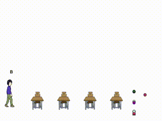
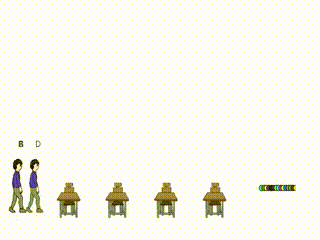

ThreadsAnim
=========

An interactive animated figure for visualizing effect of asynchronous program.

Try it now on your browser!

http://msakuta.github.io/ThreadsAnim/index.html

## Overview

It is an application to show intuition of some multithread computation strategies.

There are many strategies in parallelizing an algorithm over multiple CPU cores. With the abundance of many cores, there are a lot of opportunities to accelerate computation with multiple threads, but also multithread programming is known to be very difficult to get right and efficient at the same time.

In particular, this application demonstrates

* Thread pooling
* Work-stealing model

## GUI and Control

You can adjust the parameters on the fly and see their effect in real time.

Each person represents a worker thread, each desk represents CPU core and each ball represents a task.

The most common strategy would be to split the job into pieces (tasks) and distribute them to the threads with the same number of cores.
However, if the task has variation in workload, one of the worker threads
tend to be left with slow tasks and the other tasks will finish.

We can mitigate the problem with work-stealing model, where each worker thread fetch the next task when they are done with previous one.
In this way the threads will not finish until all the tasks are handled.

Also, when we repeat the algorithm over and over, we don't want to free the threads.
Instead, we want to reuse the same set of worker threads to avoid the overhead of creating threads (which is depicted by people walking away from desks). This is called thread pooling.

Most parallel computation libraries utilize these strategies to parallelize (e.g. Rust rayon),
but sometimes you need to wind up with your own implementation to achieve the best performance possible.

